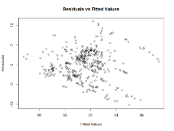

Research Project – Inequality

*George Morris*

*2024*

**1  Introduction**	 	

Inequality is a complex and persistent problem facing many modern economies to varying degrees around the world. Understanding the causes behind it is often difficult as the specific demographic, cultural, political, and fiscal situations in individual countries naturally play significant roles. Nevertheless, this project will aim to deduce whether certain factors on the macro-level can be used to see patterns between different European countries to better understand and combat this issue. The focus being on European countries as most are more advanced economies with more similar social structures. My hypothesis is that there will be a negative relationship between the level of inequality and all factors highlighted in this project. 

**2  Dataset and Data Visualisation** 

The dataset can be found on Kaggle and is created by Gapminder a Swedish non-profit organisation. The link to which can be found in the bibliography.(1) 

The dataset includes the value of the Gini-coefficient (the most widely used measure for income/wealth inequality by economists, smaller meaning more equality) for all large countries in the world for the years 2006-2016. Included also are the associated factors (independent variables) whose relationship with inequality we want to investigate. These include 

Economic metrics 

- GDP per capita in PPP measured in fixed 2011 dollars. (income per person)
- Tax as a percentage of GDP 
- Income as a percentage of GDP

A non-economic metric 

- EIU Democracy index as developed by the Economist Intelligence Unit, it is a measure of the quality of a democracy given as a number from 0-100 (100 perfect democracy). A link to exactly how it is calculated is given in the bibliography.(2)

After refining the initial dataset to leave only European countries as desired, checks for missing values were done revealing none. Therefore, the dataset was ready for initial exploration. As expected in the hypothesis, plots revealed a negative relationship between Gini value and all the  three of the four above-mentioned factors, however, they were weak. Income per person and tax as a percentage of GDP had correlation coefficients of -0.2061 and -0.2358 respectively, revealing a very weak relationship with the Gini index value. Interestingly the most significant factor amongst those chosen appeared to be the EIU democracy index, with coefficient -0.3416, also however a weak relationship. Moreover, it is clear to see from the plot between inequality and investment as a percentage of GDP, where the data is sparsely distributed and a linear relationship cannot be discerned, that there seems to be no correlation between the two, a correlation coefficient of -0.05 adds further evidence to this. 

<table>
  <tr>
    <td></td>
    <td></td>
  </tr>
  <tr>
    <td></td>
    <td></td>
  </tr>
</table>

**3  Multivariate Linear Regression** 

**3.1 Assumptions check** 

Nevertheless, we will proceed with the multivariate linear regression to discern the relationship between the level of inequality in a European country for a certain year and the respective values of all four of the above-mentioned metrics (explanatory variables). Before discussing the results of the regression, we must verify that our assumptions for a linear model are met, namely normality and homoscedasticity of the residuals. A QQ-plot showed the data fitting the diagonal line well and the histogram also suggested normality, with a successful Shapiro-Wilk test further supporting this claim. However, the plot of residual values against fitted values suggests that the variance of the residuals may not be constant, and a Breusch-Pagan test gives a p-value below 0.05 significance level of 2.2x10-16 meaning that there is statistically significant evidence to reject the assumption that the residuals are homoscedastic. Given the size of the dataset (426 data points) and potential interaction effects this is perhaps not completely unsurprising however it is certainly a significant limitation of this model and must be considered in our conclusions. Moreover, this hints that the model may be suffering from overfitting.

**3.2 Model Analysis** 

Now onto interpreting the results of the regression itself. Given the size of the model we begin by considering the adjusted R-squared value which is very low. Indeed, the model conveys that only 16% of the variance of the Gini coefficient is explained by the factors highlighted in this project. Evidence of either a weak relationship or no linear relationship at all. However, more positively the small difference (0.008) between the R-squared and adjusted R-squared which penalises larger models suggests that the model is in fact not suffering from overfitting. In addition, we see that all of the explanatory variables were statistically significant (at level 0.05) the exception being income per person (GDP per capita). The p-value due to the F-statistic also conveyed that the model had some relevance even if it is weak, with a value of 4.094x10-16.

**4  Hypothesis Test** 

**4.1 Test Selection**

This project focused on European countries to investigate inequality. This was done to better isolate the four factors chosen in this study and therefore better investigate their relationship with inequality, as European economies tend to be at a similar level of advancement and are more similar politically and culturally. This begs the question therefore if there is a difference between the mean level of inequality in Europe and the rest of the world. At first thought, a two-sampled t-test seems the correct choice. However, the assumptions required for the test, normality of the data and the same variance of both sets of data, do not hold in this case. This can be seen from QQ-plots which do not fit the diagonal well and the very large difference in the variance between the two samples (65.5320 for the rest of the world and 16.2197 for Europe). 

Therefore, an asymptotic t-test should be employed – as both samples are sufficiently large, 808 and 426 data points, the test statistic can be well-approximated by a normal distribution. 

**4.2 Asymptotic t-test**

Proceeding with the asymptotic t-test we want to see if there is a difference between the level of inequality in Europe and the rest of the world. We therefore employ a two tailed test; our hypothesis is as follows:

Where μ and ν are the means of Gini index value of countries in the rest of the world and Europe respectively. 

The test revealed a test statistic t = 28.525 with p-value 2.2x10-16 and we reject the null hypothesis. There statistically significant evidence that the level of inequality in Europe is different to the rest of the world, in fact it is much lower. 

**5 Conclusion** 

There are a number of conclusions that can be drawn from this statistical analysis. First, as hypothesised there was indeed a negative relationship between the level of inequality and three of the four metrics identified as explanatory variables in this analysis, the exception being with Investment as a percentage of GDP where there was no correlation. This negative relationship was however much weaker than anticipated, as shown by the very small adjusted R-squared value for the linear model. It is likely that other hard to quantify social, demographic, cultural and political factors not included in this analysis are of great importance. Nevertheless, the model does suggest that some relationship can be discerned, especially the link between the strength of democracy in a county and its level of inequality. The reliability of these results must however be taken into consideration. Analysis of the residuals in the multilinear model revealed that their variance was not constant (heteroscedasticity) which is a clear limitation of the model. Moreover, the dataset only investigates the years 2006-2016, a more stringent analysis of inequality should be more up to date and at least include data covering the coronavirus pandemic as an increase in inequality was witnessed in much of the western world in its aftermath. 

To Further explore the dataset, one could investigate how the level of inequality on average changed during this period or also extend the linear model to the entire world. 

Bibliography

` `- (1) <https://www.kaggle.com/datasets/psterk/income-inequality>

` `- (2) <https://docs.google.com/spreadsheets/d/1d0noZrwAWxNBTDSfDgG06_aLGWUz4R6fgDhRaUZbDzE/edit#gid=935776888>

` `- Fetsje Bijma, Marianne Jonker, Aad van der Vaart, Inleiding in de statistiek. Epsilon Uitgaven, 2016

